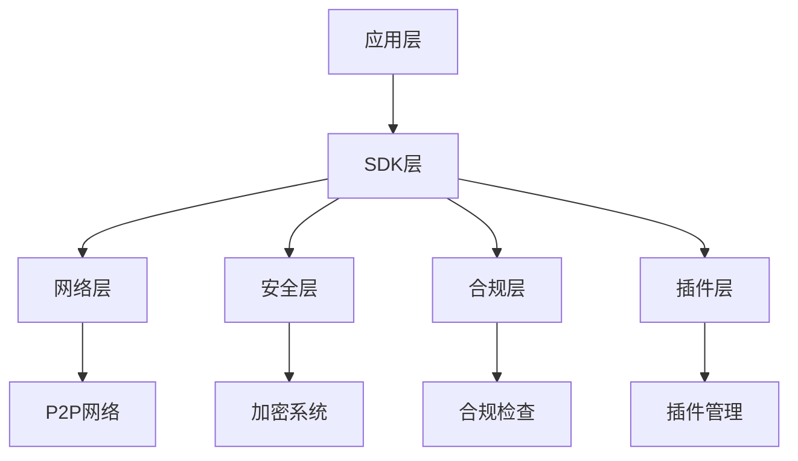
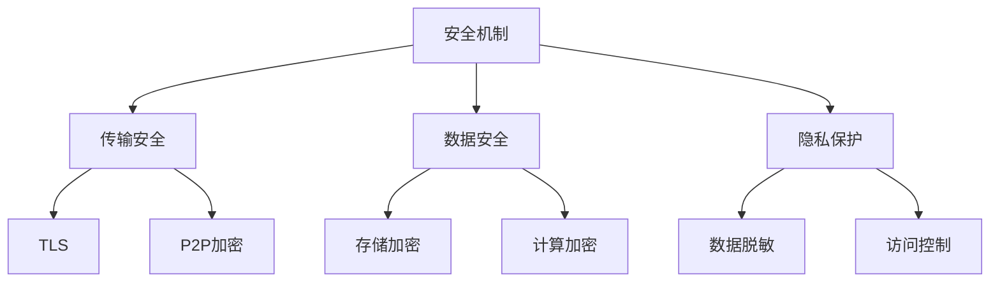

# 丝路协议（Silk Road Protocol, SRP）


丝路协议是一个创新的去中心化AI系统通信协议，专注于实现AI系统之间安全、高效、去中心化的智能交互。该协议特别针对中国市场进行了优化，支持联邦学习、高级加密和隐私保护。



## ✨ 特性

### 🌐 去中心化架构
- P2P网络通信
- 智能路由选择
- 自动节点发现
- 状态同步机制

### 🔐 安全机制
- 多重加密支持
- 同态加密计算
- 零知识证明
- 安全密钥管理

### 🤝 联邦学习
- 分布式训练
- 隐私保护
- 模型聚合
- 梯度加密

### ✅ 合规性检查
- 数据本地化
- 隐私保护
- AI伦理审查
- 合规性验证

### 🔌 插件系统
- 动态加载
- 生命周期管理
- 消息处理
- 自定义扩展

## 🚀 快速开始

### 安装

```bash
# 创建虚拟环境
python -m venv venv
source venv/bin/activate  # Linux/Mac
venv\Scripts\activate     # Windows

# 安装SRP
pip install srp

# 或从源码安装
git clone https://github.com/yourusername/srp.git
cd srp
pip install -e .
```

### 基础使用示例

```python
from srp.sdk.client import SRPClient
import asyncio

async def main():
    # 创建客户端
    client = SRPClient(host="127.0.0.1", port=8000)
    
    # 启动客户端
    await client.start()
    
    try:
        # 创建会话
        session_id = client.create_session({"user": "alice"})
        
        # 发送消息
        response = await client.send_message(
            peer_id="target_node",
            message_type="test",
            data={"content": "Hello, SRP!"}
        )
        print(f"收到响应: {response}")
        
    finally:
        # 关闭客户端
        await client.stop()

# 运行示例
asyncio.run(main())
```

## 📚 示例代码

### 1. 基础功能 (basic_usage.py)
展示了SRP的核心功能：
- 客户端创建和管理
- 节点发现和连接
- 消息发送和接收
- 会话管理

### 2. 联邦学习 (federated_learning_example.py)
展示了如何使用SRP进行分布式机器学习：
- 本地模型训练
- 安全模型聚合
- 梯度加密
- 差分隐私

### 3. 插件系统 (plugin_example.py)
展示了如何创建和使用自定义插件：
- 插件定义和注册
- 插件生命周期管理
- 消息处理钩子
- 性能指标收集

### 4. 安全功能 (security_example.py)
展示了SRP的安全机制：
- 多种加密算法
- 密钥管理和轮换
- 节点认证
- 访问控制

### 5. P2P网络 (p2p_network_example.py)
展示了如何构建和管理P2P网络：
- 节点发现和连接
- 路由表管理
- 消息路由
- 网络监控

## 📊 性能指标

- 消息延迟：< 100ms
- 节点发现：< 5s
- 路由更新：< 1s
- 加密性能：> 1000 TPS
- 安全等级：国密标准

## 🔒 安全特性



## 🌟 特别优化

### 中国市场特别优化

1. 数据本地化
   - 支持多地域部署
   - 数据主权保护
   - 合规性自动检查

2. 网络优化
   - 国内网络加速
   - 智能路由选择
   - 连接稳定性提升

3. 安全合规
   - 国密算法支持
   - 等保合规
   - 隐私计算

4. 本地化支持
   - 中文文档
   - 本地化配置
   - 技术支持

## 🤝 参与贡献

我们欢迎各种形式的贡献，包括但不限于：

- 提交问题和建议
- 改进文档
- 提交代码改进
- 添加新功能

详见[贡献指南](docs/CONTRIBUTING.md)。

## 📄 许可证

本项目采用 MIT 许可证，详见 [LICENSE](LICENSE) 文件。

## 📞 联系我们

- 官方网站：https://srp.example.com
- 邮箱：contact@srp.example.com
- GitHub Issues：https://github.com/yourusername/srp/issues

## 🙏 致谢

感谢所有为项目做出贡献的开发者！