# SRP 架构文档

## 整体架构

SRP采用分层架构设计，主要分为以下几层：

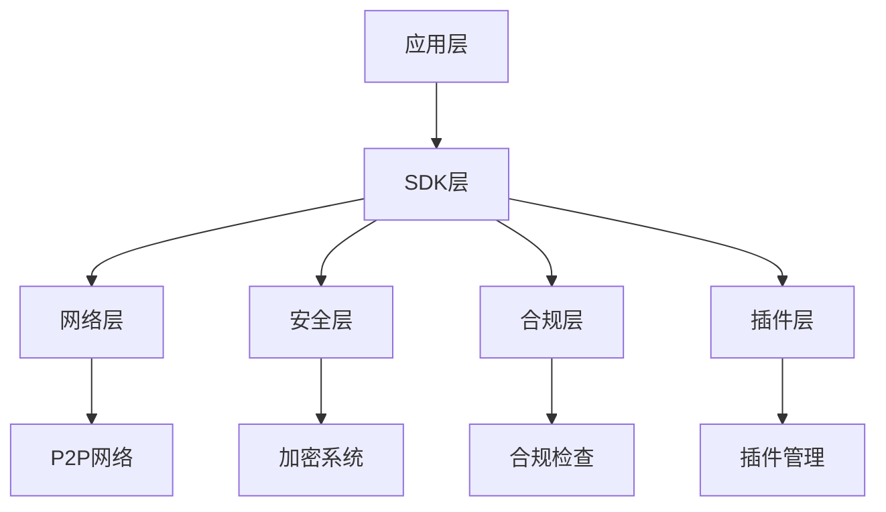

### 1. 应用层 (Application Layer)
- 提供用户接口和应用场景实现
- 处理业务逻辑和用户交互
- 管理应用状态和配置

### 2. SDK层 (SDK Layer)
- 封装底层功能为易用的API
- 提供统一的接口规范
- 处理错误和异常情况
- 管理资源和生命周期

### 3. 网络层 (Network Layer)
- P2P网络通信实现
- 路由管理和优化
- 节点发现和维护
- 消息传递和同步

### 4. 安全层 (Security Layer)
- 加密和解密
- 身份验证
- 访问控制
- 安全密钥管理

### 5. 合规层 (Compliance Layer)
- 数据合规性检查
- 隐私保护措施
- 审计日志记录
- 合规报告生成

### 6. 插件层 (Plugin Layer)
- 插件加载和管理
- 扩展点定义
- 生命周期控制
- 插件通信机制

## 核心组件

### 1. 路由系统

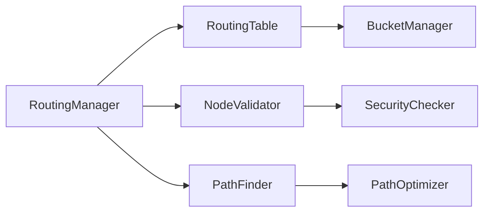

- RoutingManager：路由管理总控
- RoutingTable：路由表维护
- NodeValidator：节点验证器
- PathFinder：路径查找器
- BucketManager：K桶管理
- SecurityChecker：安全检查器
- PathOptimizer：路径优化器

### 2. 安全系统

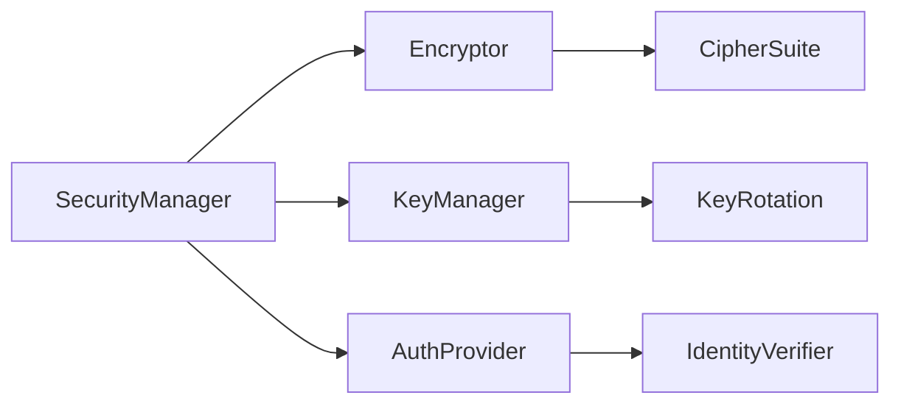

- SecurityManager：安全管理器
- Encryptor：加密器
- KeyManager：密钥管理器
- AuthProvider：认证提供者
- CipherSuite：加密套件
- KeyRotation：密钥轮换
- IdentityVerifier：身份验证器

### 3. 联邦学习系统

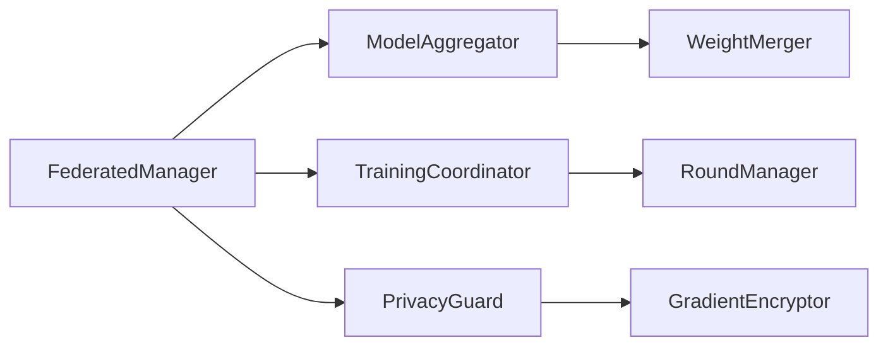

- FederatedManager：联邦学习管理器
- ModelAggregator：模型聚合器
- TrainingCoordinator：训练协调器
- PrivacyGuard：隐私保护器
- WeightMerger：权重合并器
- RoundManager：训练轮次管理器
- GradientEncryptor：梯度加密器

## 通信流程

### 1. 节点发现和连接

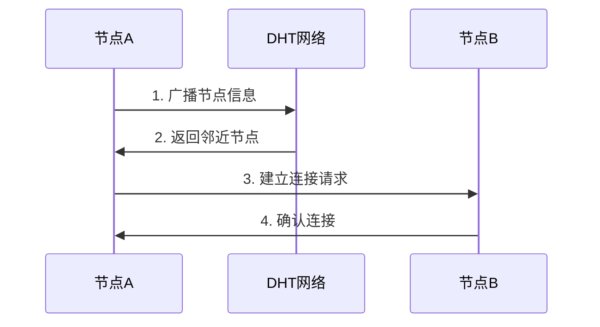

### 2. 消息传递

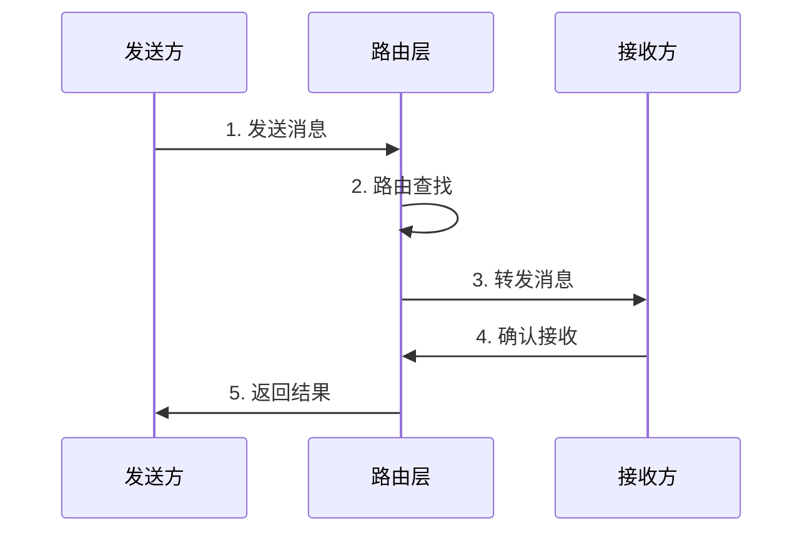

### 3. 联邦学习流程

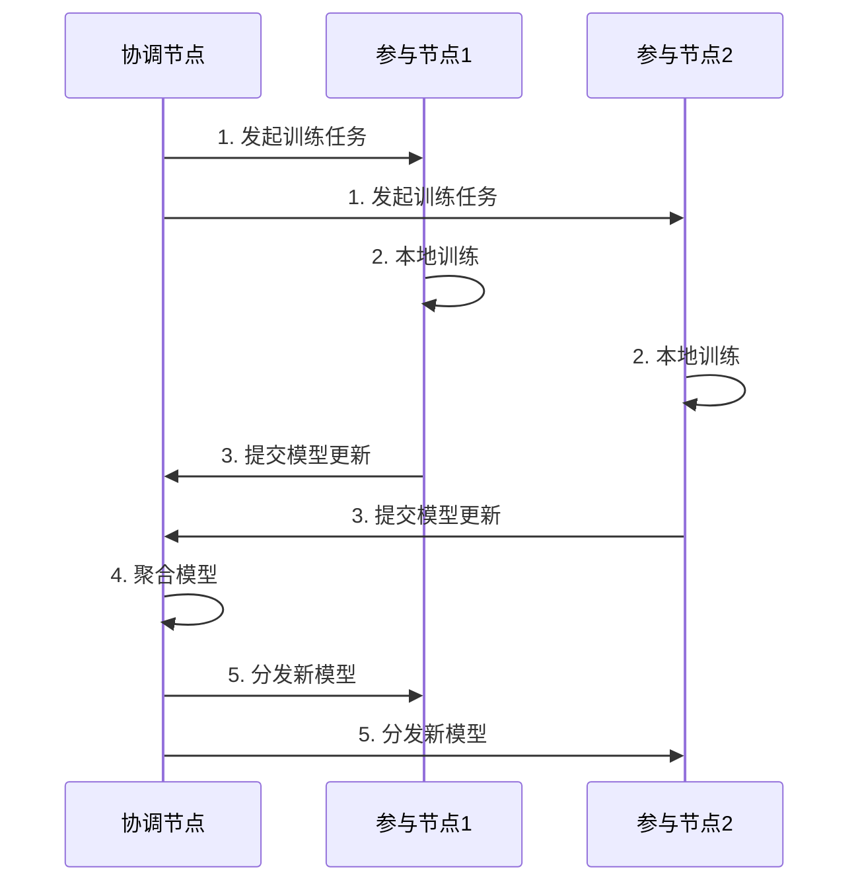

## 数据流

### 1. 消息处理流水线

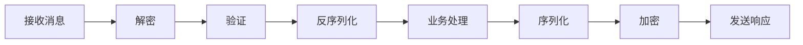

### 2. 安全数据流

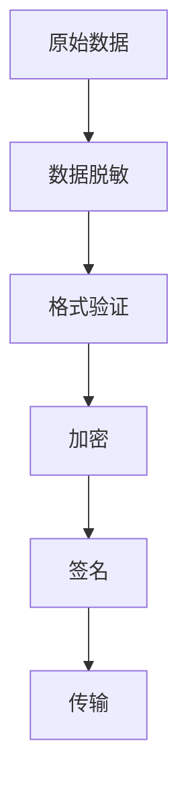

## 扩展机制

### 1. 插件系统

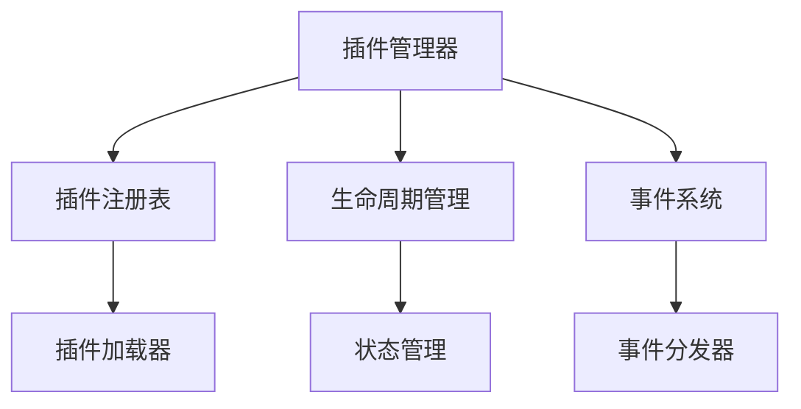

### 2. 协议扩展

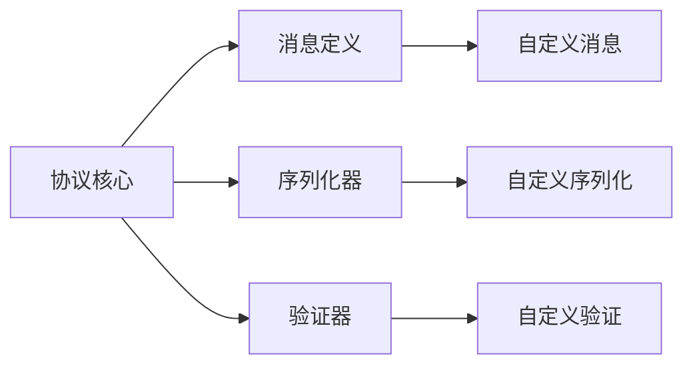

## 性能优化

### 1. 缓存机制

- 路由表缓存
- 消息缓存
- 会话缓存
- 计算结果缓存

### 2. 并发处理

- 异步IO
- 消息队列
- 任务池
- 批处理优化

### 3. 资源管理

- 连接池
- 内存池
- 线程池
- 缓冲区管理

## 部署架构

### 1. 单机部署

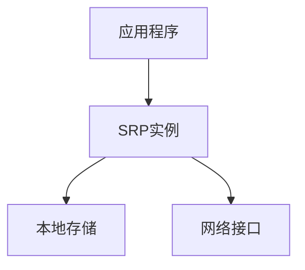

### 2. 集群部署

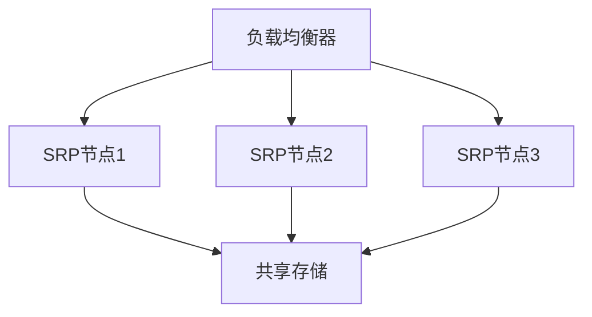

## 监控和运维

### 1. 监控指标

- 节点健康状态
- 网络延迟
- 消息吞吐量
- 资源使用率
- 错误率统计

### 2. 日志系统

- 访问日志
- 错误日志
- 审计日志
- 性能日志

### 3. 告警机制

- 阈值告警
- 异常检测
- 故障预警
- 安全告警

## 安全机制

### 1. 节点安全

- 身份认证
- 访问控制
- 加密通信
- 防重放攻击

### 2. 数据安全

- 存储加密
- 传输加密
- 数据完整性
- 隐私保护

### 3. 系统安全

- 漏洞扫描
- 入侵检测
- 安全审计
- 应急响应

## 合规性

### 1. 数据保护

- 数据分类
- 访问控制
- 数据加密
- 数据生命周期

### 2. 隐私保护

- 数据脱敏
- 匿名化处理
- 隐私计算
- 同态加密

### 3. 审计追踪

- 操作日志
- 访问记录
- 变更追踪
- 合规报告

## 总结

SRP采用模块化、可扩展的架构设计，通过分层实现功能解耦，确保了系统的可维护性和扩展性。同时，通过完善的安全机制和合规措施，保证了系统的可靠性和安全性。